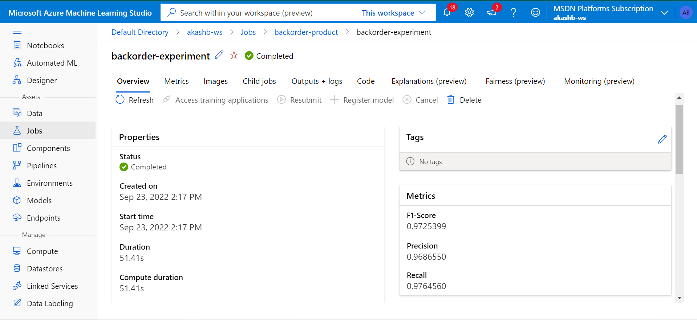
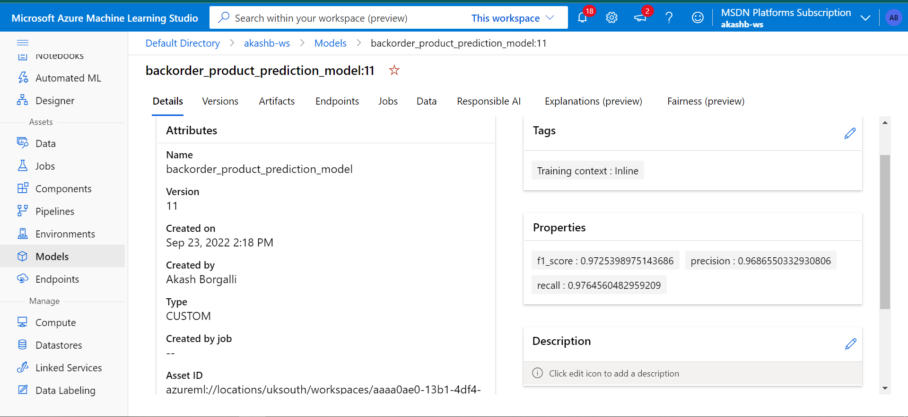

# BackOrder Product Prediction (DVC Project)

## 🤨 What is Backorder?
A Backorder is an order which can’t be fulfilled at the given time due to lack of supply or the product is currently out of stock or not in inventory but can guarantee delivery of the goods or service requested by a certain date in the future because the production of goods or replenishment of inventory is underway. Unlike in the situation of Out-of-stock where the delivery date of the goods can’t be promised , in the Backorder scenario the customers are allowed to shop for the products and order. Simply put Backorder can be thought of as an order with a delayed delivery date.

## 🤔 Why do Backorders take place?
- **When there is a sudden increase in demand:** The primary goal of all the companies is to increase the demand for the products they offer. Having a poor sales forecast system could one of the reasons for failing to predict the demand. Despite having a good sales forecasting system sometimes these situations are inevitable because of the factors which can’t be controlled or un predictable events.
- **Poor Supply chain Management:** If there is a breakdown at any point in the supply chain or due to improper planning a stockout scenario arises affecting the production. Having limited options for sourcing the raw materials and improper vendor management system is one of the significant reasons for Backorder.
- **Inventory Management:** Improper management of inventory operations and not having visibility of the inventory storage could lead to Backorders.

## 😱 Effects of Backorders:

- If many items are going on Backorders consistently it is a sign that companies operations are not properly planned and also there is a very high chance of missing out business on the products.
- Also if the customers frequently experience Backorders they switch their loyalities to your competitors.
- Backorders(unpredicted) also affect the production planning, Transportation management and logistics management etc.

## ☠ What to do to avoid Backorders ?

- Increasing inventory or stock of produts is not a solution as it increases storage costs and extra costs means they have to be included in the product prices which might result in losing business to competitors.
- A well planned Suppply Chain Management , Warehouse management and inventory management can avoid Backorders to some extent.

## 🤝 Need for Having Backorder prediction system:

- Backorders are inevitable but through prediction of the items which may go on backorder planning can be optimized at different levels avoiding un expected burden on production , logistics and transportation planning.
- ERP systems produce a lot of data (mostly structured) and also would have a lot of historical data , if this data can be leveraged correctly a Predictive model can be developed to forecast the Backorders and plan accordingly.g

🚩 ***Problem Statement***: \
Classify the products whether they would go into Backorder(Yes or No) based on the historical data from inventory, supply chain and sales.

# 🎯***Solution***:

- Backorders are inevitable but through prediction of the items which may go on backorder planning can be optimized at different levels avoiding un expected burden on production , logistics and transportation planning.
- ERP systems produce a lot of data (mostly structured) and also would have a lot of historical data , if this data can be leveraged correctly a Predictive model can be developed to forecast the Backorders and plan accordingly
- Hence, building a robust machine learning model that would determine whether product will go in backorder or not will be profitable to the business.

## 📜 Data Description:
The dataset provides 23  input variables that are a mixture of categorical and numerical data types. The complete list of variables is as follows:

* **sku(Stock Keeping unit) :** The product id — Unique for each row so can be ignored
* **national_inv :** The present inventory level of the product.
* **lead_time :** Transit time of the product.
* **in_transit_qty :** The amount of product in transit.
* **forecast_3_month, forecast_6_month, forecast_9_month :** Forecast of the sales of the product for coming 3, 6 and 9 months respectively.
* **sales_1_month, sales_3_month, sales_6_month, sales_9_month :** Actual sales of the product in last 1, 3, 6 and 9 months respectively.
* **min_bank :** Minimum amount of stock recommended.
* **potential_issue :** Any problem identified in the product/part.
* **pieces_past_due:** Amount of parts of the product overdue if any.
* **perf_6_month_avg, perf_12_month_avg :** Product performance over past 6 and 12 months respectively.
* **local_bo_qty :** Amount of stock overdue.
* **deck_risk, oe_constraint, ppap_risk, stop_auto_buy, rev_stop :** Different Flags (Yes or No) set for the product.
* **went_on_backorder :** Target variable, product went on backorder or not

## 📝 Features used from AzureML for this project

- Fetch the data from registered datastore.
- Logs Important Metrics and images on experiment dashboards
- Register the Model

## ⚙️ Data Preprocessing Techniques used
Steps : 1. Dropped last record.\
2. Changing Categorical features to numerical.\
3. Removing non significant features from the dataset
4. Replacing the constant values with NaN values
5. Filled missing values using IterativeImputer for lead_time, perf_6_month_avg and perf_12_month_avg columns.\
6. To handle skewness applied cuberoot for columns 'national_inv','lead_time', 'in_transit_qty' , 'forecast_6_month', 'sales_1_month', 'sales_3_month', 'sales_6_month' , 'min_bank', 'pieces_past_due', 'perf_6_month_avg', 'perf_12_month_avg', 'local_bo_qty'.\
7. Applied Smoteenn to handle imbalanceness of target feature\
8. Enforced Robust-Scaling on entire dataset.\

## ✔️ Deployment
- Used LightGBM Model for Deployment with Recall of 0.97.
- Its DVC Project

## 💻 Tech Stack

**Cloud Platform:**  Azure Machine Learning , DVC

**Language:** Python 3.6.2, shell-scripting

## 💡 Screenshots:
- **Performance Metric of an experiment over Azure**

- **Registered Model(Light Gradient Boosting Model) on Azure**

## Author 

- [@Akash Borgalli](https://www.linkedin.com/in/akashborgalli/)